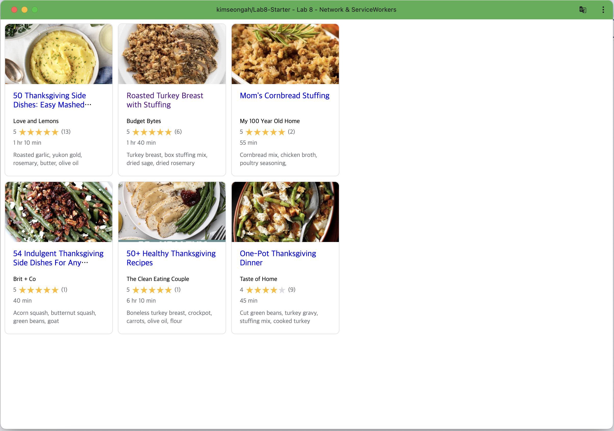

# Lab8-Starter

- Seongah Kim
- [Deployed Github Pages URL](https://kimseongah.github.io/Lab8-Starter/)
- Graceful degradation ensures that a website remains usable even if certain features fail due to outdated technology or browser limitations.
- Service workers enhance this approach by acting as a proxy to manage data caching and network requests, allowing the website to maintain core functionalities offline or in less capable environments, thus supporting a smoother, more reliable user experience.
- 